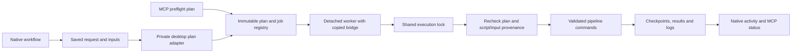

# iProteinStudio architecture

iProteinStudio is a native macOS front end for protein prediction, iterative
sequence design (Protein Hunter), ligand NISE and RFdiffusion3 backbone design. Scientific implementations and
validated defaults remain in the upstream-derived pipeline, predictor adapters
and pinned engines. Studio owns request preparation, workspaces, durable job
ownership, result presentation and installation.

## Repository boundaries

| Location | Responsibility |
|---|---|
| `Sources/StudioCore/` | UI-independent recoverable JSON storage, archive journal, execution lease and allowlisted support reports |
| `Sources/iProteinStudio/Models/` | Requests, validation issues, result identities, grouping and saved verdicts |
| `Core/Jobs/` | Native client of the durable job registry; submission, observation, Stop, Resume |
| `Core/Results/` | Filesystem discovery and asynchronous, coalesced result loading |
| `Core/RunHistoryStore.swift`, `Core/MetricsWatcher.swift` | History and live metric scans off the main actor |
| `Core/AppPaths.swift`, `Core/PipelineInstaller.swift` | Bundled resource staging and managed runtime maintenance |
| `State/AppState.swift` | Workspace index, recovery, archive/restore and startup reattachment |
| `Views/` | Native setup, workflow forms, activity, dashboards, results and support-report preview/export |
| `Resources/pipeline/` | Vendored runner, helpers, installer and client-neutral MCP bridge |
| `Resources/rfd3/`, `Resources/rfd3_overlay/` | Studio adapters and the pinned upstream campaign overlay |
| `Resources/web/py2dmol/` | Bundled offline viewer and Studio adapter, including cycle playback |
| `Tests/` | Explicit fixture runner, executable Swift contracts and StudioCore XCTest target |
| `Validation/` | Declared hardware/scientific campaigns; read its own AGENTS.md before changes |
| `tools/pipeline-vendor-manifest.json` | File ownership, local baseline hashes and upstream review provenance |

This is an incremental split. Some models still contain parsing/grouping helpers,
and feature views remain sizeable. Moving files alone does not establish a safe
scientific boundary; executable contracts and provenance checks do.

## Job ownership



The native adapter accepts workspace/workflow/output identity, then reads the
saved request and constructs the fixed workflow command. It preserves iterative
argv, MSA policy and scheduler overrides. It is private to `studioctl`; MCP's
read/run/admin permission profiles remain separate.

Workers outlive the app. The native controllers observe durable state and can
reattach after relaunch. Stop enters `stopping`; the worker stops/reaps its child
process group before publishing `cancelled` and releasing its execution lease.
Queued jobs also remain cancellable. A job's copied bridge survives later app
updates. Workers from before this lifecycle contract must be stopped with their
originating client; the new bridge refuses to signal them using incompatible
semantics.

Iterative runs use their content-addressed pipeline snapshot. Prediction and
RFdiffusion3 record script/input hashes and reject changes while queued or at
resume. RFdiffusion3 also records prepared config/assets after successful
preflight, verifies them and skips preparation on Retry. Completed work stays on
disk. This does not make arbitrary external runtime modifications safe.

Installation, repair, staging and destructive maintenance use the same execution
lock. Workspace transfers acquire registry then execution locks and reject
queued/active workspace jobs. Runtime staging can be deferred while work is active.

## Workspace and result ownership

Workspace `config.json` writes atomically and keeps a validated `.previous`
copy. Unreadable primary data cannot be overwritten by an empty workspace list.
Recovery preserves the damaged bytes; unrecoverable storage pauses editing.

Archive moves a workspace into `archived-workspaces/<workspace UUID>` and updates
the index through a journal. Recovery distinguishes a committed index from an
interrupted transfer. Restore returns files to their original path, retaining
existing absolute checkpoint references. Archive is not permanent deletion.

Dashboards are selected by their saved workspace/run identity. Iterative headers
and thresholds come from the saved launch context. Results group iterative runs
by cycle and RFdiffusion3 backbones by MPNN derivative; a saved hit belongs to the
independently checked child, not simply a design-stage score.

Result loads coalesce across views and execute outside the UI actor. Metadata
fingerprints detect changes during a read and retain the previous snapshot;
malformed duplicate-header and incomplete CSV rows are rejected. Live metrics
retain observed checkpoints across partial rewrites. This is polling with a
bounded short-lived cache, not a persistent index or a measured performance claim.

## Managed runtime

The default root is `~/.iproteinstudio`; runtime code derives it through
`NANOHUNTER_ROOT` or resource locations. Relevant paths include:

```text
config.json + config.json.previous
workspace-transfer.json                 present only during a transfer/recovery
projects/<slug>/...                      original run paths
archived-workspaces/<UUID>/...
agent/{plans,jobs,execution.lock,registry.lock}
agent/jobs/<job>/bridge/                  copied worker implementation
agent/jobs/<job>/{state.json,plan.json,pipeline.log,job.log}
target_predictions/<key>/prediction-<UUID>/
target_predictions/<key>/current-result.json
models/, src/, venvs/, rfd3/, rfd3_scripts/
msa_cache/, scaffold_msa_cache/
```

Target preparation and calibration also submit managed jobs. Target preparation
uses a new attempt folder and only promotes a completed result. Old cache files
are retained across a failed new attempt. Legacy target caches remain readable.

## Upstream refresh and validation

`tools/sync_pipeline.sh UPSTREAM_CHECKOUT` stages an ignored review directory; it
does not replace shipped files. `--apply REVIEW_DIRECTORY` verifies the manifest,
review and current hashes first. The Studio-modified runner requires a manual
merge. Ownership rules come from the tracked manifest, not editable review data.
Apply keeps backups and rolls back replacements after an I/O error; it is not a
crash-atomic multi-file transaction. Review the resulting diff and run contracts.
The recorded initial baseline explicitly includes the existing local work.

See [Testing](docs/TESTING.md), [CLI and MCP](docs/CLI.md) and
[Lab Book 0088](lab_book/0088-implement-product-reliability.md). No model weights
belong in this repository. Ligand NISE uses a versioned upstream port and the
same broker, snapshots and resident-worker protocol; see [NISE](docs/NISE.md).
Protein/cross-reactive NISE and RFdiffusion3 against DNA/RNA remain out of scope.
