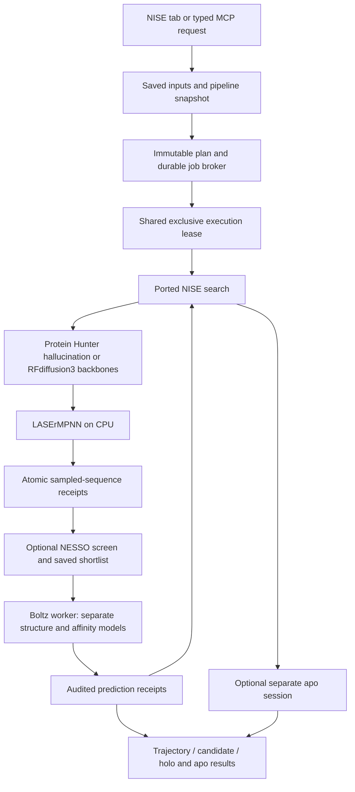

# Ligand NISE in Studio

The workspace offers **Protein Hunter**, **NISE**, **RFdiffusion3**, and **Predict**.
Protein Hunter is the display name of the existing iterative workflow; its saved
`iterative` identity and old workspace/run files are unchanged. NISE has its own
request and campaign identity. It searches for small-molecule-binding proteins;
initial backbones can come from Protein Hunter hallucination or RFdiffusion3.
Beta's protein/cross-reactivity optimiser remains upstream.

## What the fluorescein work established

The work spans two source repositories:

* NanoHunter's `scripts/nise/{nise_run,nise_lib}.py` owns the small-molecule
  selection/expansion search. Its `output/nise_fluorescein/` contains the original
  trajectory table, per-trajectory winners and summary. `nise_fluorescein_v2/` is
  a separate run and must not be pooled with it.
* Beta commit `0f372533ec7b02e23819c1512c6033aed9265356` added the optional
  preorganisation funnel in `scripts/nise_beta/preorg.py`, using geometry from
  `metrics.py`. Its README describes an analysis of cycle 9, trajectory 4 of the
  completed fluorescein run. It reordered candidates within the selected
  shortlist. This was a computational smoke, not a binding experiment or a
  prospective full-campaign comparison of objectives.

The ligand is **fluorescein hydroxyethylamide**, the same example already bundled
with Studio. It contains a presentation linker. The original ligand NISE search
does not implement RFdiffusion3's core-buried/linker-exposed atom conditioning.
Studio now adds explicit hotspot/exposure choices and predicted-geometry checks,
without assigning them automatically when loading the example (see below).

The source has evolved since the original completed run: the saved historical
trajectory uses older Phase-0 names, while today's driver has constrained
refinement, an unconstrained gate and an expansion stage. The old configuration
writer also overwrites `config.json` on resume. The original `phase0/cycle00`
outputs contain **100** starting inputs and completed structures, `L000`–`L099`,
even though the later saved configuration says 12. Six trajectories entered
optimisation. Studio now defaults to **1,000 starts**, as requested; this does not
claim that the current initial refinement recipe exactly reproduces the old run. Consequently an old run folder
and today's shell launcher do not establish identical commands or seeds.
Studio ports the current inspected source and records its exact hashes, rather
than claiming byte-for-byte recreation of that historical search.

The imported files' repository, source path, revision and original file hash are
in [UPSTREAM.json](../Sources/iProteinStudio/Resources/pipeline/scripts/nise/UPSTREAM.json).
NanoHunter's MIT notice is retained. Only the user's beta geometry/funnel code
is imported; beta's vendored LigandMPNN and ipSAE implementations are not copied.

## Preserved scientific behavior

By default, the broad search creates random partly X-masked starting binders.
The optional RFdiffusion3 generator supplies ligand-conditioned backbones instead.
Both methods enter the same initial refinement, gate and expansion funnel. Pocket-guided
refinement keeps the best descendant of each lineage. The following gate removes
the pocket restraint and checks binder self-consistency; expansion selects
diverse starting trajectories with at most one seed per surviving lineage.

Each deep-search trajectory then keeps its own beam, best-so-far design and
no-improvement counter. LASErMPNN expands its current design, Boltz predicts the
ligand complex and affinity, and the driver filters/ranks the candidates. Ligand
self-consistency is enabled after the recorded initial cycles. A stopped
trajectory does not donate its budget or winners to a different trajectory.

## Efficient search policy (new runs)

New requests use policy version 3: **1,000 starting backbones, up to eight distinct-lineage
seeds, beam three, 30 optimisation cycles and four-cycle patience**. Starts remain
user-adjustable. The initial recipe remains two
three-proposal pocket refinements, a three-proposal unrestrained gate and five-proposal
survivor expansion. No rollback or rescue is implemented.

The first refinement now requires a winning Boltz score of **at least 0.80** after
requested geometry checks. Set `early_score_gate` to zero to disable this extra gate;
zero refinement rounds also bypass it. The threshold always means
`ligand_pLDDT/100 + Boltz P(bind)`, including when NESSO supplied the shortlist.
It is not a threshold on the differently calibrated NESSO metric.

**Selective affinity** is on for new runs. Cycle 00 and the unrestrained gate omit
affinity because their advancement uses geometry. Other stages fold first, check
RMSD and requested atom requirements, and evaluate affinity only for eligible
candidates. Candidates are visited in decreasing ligand pLDDT, in selection batches
(default eight, not eight simultaneous GPU jobs). The bound `ligand_pLDDT/100 + 1`
can rule a candidate out only when it is strictly below the applicable boundary:
its lineage winner, the distinct-lineage seed cutoff, or its trajectory's beam cutoff.
Ties are evaluated. Previously evaluated top-up candidates contribute to the boundary.

Boltz inputs retain their affinity property so preprocessing uses the same chemical
state and saves `pre_affinity_*.npz`. The resident worker runs the structure and
affinity stages separately; the latter consumes that verified full-precision output
without refolding. Model weights stay resident across the stage's requests. Receipts
for structure and affinity are separate, and resume verifies both inputs and outputs.
An unscored candidate has a null score and an explicit reason, never an invented zero
or a ligand-pLDDT-only search score. The mathematical pruning preserves selection for
fixed predictions and affinity values; this is not a claim of bitwise identity with
an older combined stochastic inference run.

**Adaptive proposals are an experimental opt-in.** Start at 16 per parent and top up
the same parent set to its cap (now 64 in cycle 1, 32 in later cycles by default).
If the cap is explicitly set to 64, these cost
16 + 16 + 32 proposals, not 16 + 32 + 64. Each trajectory stops topping up when its
pooled best score exceeds its previous best by more than `min_improvement` (default
0.01). Otherwise it exhausts the cap and advances the best passing beam. All evaluated
rounds compete together; a failed small batch can receive a top-up. With no passing
candidate after the cap, that trajectory stops. Patience advances once per completed
cycle, not once per top-up. Any new best is retained even if its gain is too small
to reset patience. Full last-improving beams, structures and hashes are recorded.

With NESSO enabled, each **new proposal batch** gets its own per-trajectory shortlist;
all candidates actually folded across these shortlists compete together. For example,
a shortlist of 16 and three rounds can produce up to 48 Boltz folds per trajectory
per cycle. This prevents a fully used first shortlist from making later top-ups
ineffective. The UI's prediction budget includes all possible rounds. Initial-stage
NESSO screening remains separate and the unrestrained gate remains unscreened.

Saved old workspaces decode to policy 1: no new early gate, exhaustive affinity,
adaptive off and their old budgets. Resetting to **Default settings** explicitly
chooses the new recipe. Frozen campaigns keep their recorded code and settings.
The controls in both stage panels, including advanced score/filter controls, are
saved in the request and exposed through the MCP schema.

The user-supplied biotin retrospective reported roughly 52% fewer affinity evaluations
and 37% fewer structure evaluations for particular combinations of changes. Those
are **not measurements reproduced in Studio**. The 0.80 threshold and any bounded search
budget can lose good lineages on other ligands; adaptive savings remain unmeasured.
`search_cost.json` records completed unique evaluations; `proposal_round.json` records
incremental counts and fixed parents; `advancement.json` records beams and patience.
Best-so-far outputs retain the checks from the stage where they were evaluated;
they are not automatically recertified against later ligand-RMSD gates.

## Binding hotspots, atom labels and linker exposure

Under **Small molecule**, choose **Load molecule and atom labels**. Review the
labelled diagram, then use each atom's **None / Bind / Expose** control. The
diagram highlights the selected regions. **Bind** requires a protein heavy atom
within the selected distance of every hotspot (default 6 Å). **Expose** requires
every selected atom to retain at least the selected fraction of its unbound
solvent accessibility (default 50%). An atom cannot have both requirements.
Changing SMILES clears atom choices; changing an installed atom-mapping runtime
requires reloading and explicitly reselecting them. Loaded selections are
verified before the Start button enables.

**Numbering is engine-specific.** Boltz affinity standardizes SMILES before
adding hydrogens and assigning canonical-rank names. This can change chemical
state and renumber atoms. NISE uses the installed Boltz standardizer and displays
that standardized molecule, rather than guessing a correspondence to a chemically
different input drawing. The original SMILES, actual engine SMILES, exact Boltz
names/elements, RDKit version and Boltz parser fingerprint are saved in
`ligand_atom_map.json`. A missing standardizer, stale mapping or changed output
atom set fails explicitly. Ligand RMSD matches names/elements, not PDB row order.

RFdiffusion3 receives the same standardized SMILES. Its existing ligand
preparation produces an input-order atom map; Studio translates selected names
into that map for diffusion conditioning, then translates only the NISE reference
copies back into Boltz names. `atom_translation.json` preserves the correspondence.
NESSO receives the same SMILES with the protein sequence and no external atom
indices or pocket constraints. Its native names use a different convention;
Studio checks the prepared chemical graph/state and saves its separate names in
`ligand_identity.json` beside each screening result.

**Generation and checking have different roles.** Protein Hunter uses hotspots
as positive pocket restraints during hallucination and initial refinement. With
no explicit hotspots, its automatic contact selector excludes exposed atoms.
RFdiffusion3 also receives explicit hotspot/exposure conditioning for its initial
backbones. Boltz has no negative exposure restraint. From the unrestrained gate
onward, the pocket restraint remains off as in the original NISE protocol.
Geometry requirements filter every sequence-bearing refinement, gate, expansion
and optimisation candidate before advancement. With selective affinity enabled,
requested atom checks also filter cycle-00 proposals from either generator.
A failed requirement is never converted into a passing hit by a high affinity
score. All rejected candidates retain their measured checks and failure reasons.

Exposure is measured using [RDKit's FreeSASA implementation](https://www.rdkit.org/docs/source/rdkit.Chem.rdFreeSASA.html):
Shrake–Rupley, a 1.4 Å solvent probe, heavy atoms and explicit RDKit elemental
van der Waals radii. For each selected atom, divide its SASA in the complex by its
SASA in the same ligand conformation with protein removed. An atom with ≤0.1 Ų
unbound SASA cannot satisfy an exposure request. This is distinct from
RFdiffusion3's learned exposure conditioning. The 50% default is an experimental,
user-adjustable geometry criterion, not an empirically validated binding or
conjugation threshold. Accessibility to a water probe does not establish access
for a large attached bead/protein or prove experimental binding.

Inspect **Open atom checks** after a run, including a run that exhausted its
initial candidates. `atom_checks.csv` contains distances, per-atom areas,
retained fractions and failure reasons; candidate JSON records are checkpointed
throughout. These CPU geometry checks do not change the resident-model policy.
No user-selected atom requirements are imposed by default.

## Two stages, separate controls

**1,000 is the Studio default, not a model limit.** The first Studio tab exposed
1–100 starting attempts and fixed the within-trajectory beam to one. The form
now accepts typed values, supports 1–10,000 starting attempts, and exposes both
the initial funnel and the number of sequences advanced during optimisation.
The wider input ranges are product limits, not measured throughput or memory
claims. Start with a small trial and review the displayed prediction counts.
Existing saved workspaces retain their previous values and decode missing new
fields to the historical recipe (including advancement of one and NESSO off).

| Stage | Control (saved key) | Meaning | Reference default |
|---|---|---|---:|
| 1 · Initial backbones | Backbone generator (`backbone_method`) | Protein Hunter X-token hallucination or experimental RFdiffusion3 | Protein Hunter |
| 1 | Length groups (`rfd3_num_bins`, RFdiffusion3 only) | Evenly spaced binder lengths; the count is capped by starts and distinct available lengths | 5 |
| 1 | Starting backbone attempts (`num_starts`) | Total initial starts / lineages, shared across all RFdiffusion3 length groups when selected | 1,000 |
| 1 | Binder length (`binder_min_len`, `binder_max_len`) | Initial length range in residues | 65–150 |
| 1 | Pocket refinement rounds (`phase0_refine_cycles`) | Constrained refinement, keeping the best descendant per lineage | 2 |
| 1 | Refinement sequences (`phase0_seqs1`) | Sampled per lineage in each pocket-guided refinement round | 3 |
| 1 | Gate sequences (`phase0_gate_seqs`) | Sampled per lineage; every sequence is folded without the pocket restraint | 3 |
| 1, optional | Initial NESSO screen (`phase0_nesso_screen`) | Independent of the optimisation switch | Off |
| 1, optional | Refinement shortlist (`phase0_nesso_refine_top_k`) | Sequences folded per lineage per refinement round | 1 |
| 1, optional | Expansion shortlist (`phase0_nesso_expand_top_k`) | Total sequences folded after NESSO scores all expansion derivatives; maximum one per original lineage | 20 |
| Advanced | Gate Cα RMSD (`phase0_sc_ca`) | Initial unrestrained gate cutoff in Å | 2.0 |
| Advanced | Optimisation RMSD (`nise_sc_ca`, `nise_sc_lig`) | Parent–candidate Cα and ligand cutoffs in Å | 2.5 / 2.5 |
| Advanced | First ligand-check cycle (`nise_ligand_sc_from_cycle`) | Optimisation cycle at which ligand RMSD becomes required | 3 |
| 1 | Expansion sequences (`phase0_seqs2`) | Sampled per gate survivor before choosing diverse trajectory seeds | 5 |
| 2 · Optimisation | Independent trajectories (`trajectories`) | Up to one seed per surviving initial lineage; may be fewer than requested | 8 |
| 2 | First-cycle proposals (`first_cycle_seqs`) | Sampled from the starting seed in cycle 1 | 64 |
| 2 | Later proposals per parent (`nise_seqs`) | Sampled from **each** retained parent from cycle 2 | 32 |
| 2 | Sequences to advance (`beam`) | Maximum passing, Boltz-ranked sequences retained **per trajectory** as the next cycle's parents | 3 |
| 2 | Maximum cycles / patience (`max_cycles`, `patience`) | Cycle limit and per-trajectory stop after no improvement | 30 / 4 |
| 2, optional | NESSO shortlist (`nesso_top_k`) | Candidates sent to Boltz **per trajectory per proposal round**, pooled across that trajectory's parents | 16, screening off |

A trajectory starts with one parent. The defaults produce 64 sequences in cycle 1
and up to 3 × 32 = 96 per later cycle, per trajectory. Optional partial noising
adds a separate branch from cycle 2; its costs and reserved beam places are described below.
With adaptive proposals and partial noising off and a NESSO shortlist of 16, all sampled sequences are screened and at most
16 are folded by Boltz per trajectory per cycle; up to three passing folded
sequences advance. Without NESSO all sampled sequences in each executed round are folded. The shortlist
must be at least the advancement count and no larger than the per-parent sample
count. The actual shortlist is capped by the available candidates in each batch. A smaller passing pool reduces actual
advancement; Studio never invents survivors or borrows from another trajectory.

The initial funnel has at most
`starts × [1 + refinement_rounds × refinement_sequences + gate_sequences + gate_sequences × expansion_sequences]`
Boltz predictions. The extra round is the unrestrained gate. At the current default
settings this is **25,000** initial predictions for Protein Hunter. RFdiffusion3
replaces the first prediction per start with a diffusion backbone: **1,000
RFdiffusion3 backbones plus at most 24,000 initial Boltz predictions**. These
counts are calculated from the recipe. These
are counts, not measured speed estimates. The form separately previews the
first optimisation cycle, later cycles, and maximum total optimisation folds.
With initial NESSO enabled, the calculated Boltz upper bound becomes
`starts × [hallucination + refinement_rounds × refinement_shortlist + gate_sequences] + min(starts, expansion_shortlist)`,
where `hallucination` is 1 for Protein Hunter and 0 for RFdiffusion3. At the
reference settings that is **6,020** Boltz predictions, or **5,020** plus 1,000
RFdiffusion3 backbones. NESSO additionally scores up to 21,000 sequences
(1,000 × 2 × 3 refinement candidates + 1,000 × 3 × 5 expansion candidates).
These are arithmetic work counts, not measured throughput or a speedup claim.

Patience and failed structural checks can reduce actual work. `Small trial`
changes the visible budget and length range without changing Boltz recycles,
diffusion steps, objectives or consistency thresholds.

The objective is `ligand_pLDDT / 100 + affinity_probability_binary`. The port
requires both finite values in their documented ranges. The old `auto` and even
explicit combined-score path silently fell back when affinity was missing;
Studio instead fails. Protein ipSAE objectives and alternative predictor-family
scores are not substituted for ligand affinity.

The optional final analysis takes the top requested number of passing deep-search
candidates across the completed search, folds them without ligand, affinity
properties, pocket restraints or steering, and measures:

* Pocket all-heavy-atom RMSD after fitting the pocket backbone.
* Pocket Cα displacement after fitting the surrounding scaffold.
* Whole-binder Cα RMSD between apo and holo predictions.

It uses beta's original weighted pocket/fold rewards and presents a separate
combined score within the tested shortlist. It does not alter search advancement
or patience. This final cross-campaign shortlist is an integration choice;
beta's original example analyzed one trajectory/cycle slice. Missing requested
apo measurements fail the analysis while preserving all search outputs. This
replaces beta's ambiguous skipped-entry handling with an explicit incomplete job.

## Choosing the initial backbone generator

In **1 · Initial backbone generation**, choose **Protein Hunter · X-token
hallucination** or **RFdiffusion3 · ligand-conditioned diffusion**. Protein Hunter
remains the default. Changing the generator preserves the other displayed search
budgets, NESSO settings and optimisation controls. Existing saved requests without
a generator field decode as Protein Hunter; explicit previous starting counts
are retained. **Default settings** resets the form to 1,000 starts and Protein Hunter;
**Small trial** reduces the budget while retaining the chosen generator.

RFdiffusion3 requires the existing **RFdiffusion3** engine installation in addition
to Boltz, its affinity checkpoint and LASErMPNN. Studio derives one ligand
conformer from the supplied SMILES using the saved seed and the existing ligand
preparation script. The generated CCD, atom map, conformer, design specification
and official Foundry feature fixtures are saved with the campaign. Ligand atoms
are fixed during diffusion. Explicit NISE hotspot/exposure selections become
`select_hotspots`/`select_exposed` in the diffusion input. Nothing is inferred
from the example or from leaving an atom unselected.

The default five length groups span the requested length range. For 65–150
residues these are 65, 86, 108, 129 and 150, receiving 20 backbones each at the
1,000-start default. One group uses the rounded-down midpoint. Shorter ranges or
fewer starts reduce the actual number of groups, which the form previews.
The total requested starting count is **not multiplied** by the number of groups.

Generation reuses the shipped ligand RFdiffusion3 path and its explicit settings:
200 diffusion steps, two recycles, BF16, native batches of up to eight and up to
two queues within each length group. Groups run sequentially. These settings
come from the existing generator; its upstream mixed-length measurements do not
establish NISE performance. The new generator-to-NISE connection is experimental.
Weights stay loaded across batches within each live queue. All generation queues
exit before Boltz or NESSO starts; there is no overlap with those model workers.

A successful backbone becomes a separately identified NISE lineage, with binder
chain A and ligand chain B. Studio checks its length, coordinates and exact ligand
atom names before LASErMPNN sees it. The original RFdiffusion3 atoms are retained
in raw outputs; the NISE reference copy uses Boltz affinity names mapped through
the shared SMILES input order and validated elements. It receives no invented Boltz score: scoring
starts with the common initial sequence/refolding funnel. The unrestrained gate,
trajectory selection, optional NESSO screen and cycle advancement then operate
as for the Protein Hunter generator.

RFdiffusion3 generation checkpoints each completed native batch, including the
accepted structures, metadata, rejected attempts and exact seed cursor. Resume
checks committed file hashes and reuses those batches. Files from an uncommitted
batch are retained in an `interrupted` directory and that batch can be rerun.
Completed queue replay does not reload model weights. Preparation has its own
receipt; incomplete preparation is preserved and regenerated, while completed
ligand/fixture files are checked before reuse. A failed requested generator stops
the run; it never substitutes Protein Hunter hallucination.

## Optional NESSO screening (experimental)

Stage 1 and stage 2 have independent NESSO switches and shortlist sizes.
Both are off by default, preserving existing saved campaigns. Install **NESSO-1 (experimental)** through **Engines** first;
its weights and ESM model are optional downloads and are never included in the
app or DMG. **No separate ESM installation step is required.** NESSO's installer
includes the exact ESM-2 `esm2_t33_650M_UR50D` model and tokenizer it needs.
Other tools' ESM software is not interchangeable: Protenix's optional ESM path
uses `esm2_t36_3B_UR50D` (including its ISM variant), and AntiFold uses an
inverse-folding architecture. NESSO uses its pinned Transformers environment.
The installer can copy exact, SHA-256-matching ESM assets from the configured
Hugging Face cache or Studio's cache, avoiding another download. Files with
other hashes are ignored; another architecture is never substituted. NESSO owns
its verified copy so changing another tool cannot change a saved NESSO install.

Studio uses NESSO to screen sequence–small-molecule affinity; its current
adapter returns scores, not starting backbone coordinates. It requires complete
amino-acid sequences. The initial Protein Hunter inputs contain about 50% X
residues, and RFdiffusion3's initial outputs are backbone coordinates, so neither
is a suitable direct input to this sequence-screening step.

Enable **Use NESSO to shortlist initial sequences** in stage 1 for this funnel
(cycle numbers below assume the default two refinement rounds):

1. **Cycle00 — backbone proposal.** Generate Protein Hunter X-token structures
   or RFdiffusion3 backbones. NESSO does not score these incomplete sequences.
2. **Cycle01 and cycle02 — pocket refinement.** LASErMPNN samples three complete
   sequences per lineage. NESSO scores all three; the best one per lineage goes
   to Boltz with the pocket restraint. Boltz scores it and checks requested
   hotspot/exposed atoms. One passing structure per lineage advances. Advanced
   controls can increase the number sampled and the NESSO shortlist; Boltz
   chooses the best passing structure when more than one is folded.
3. **Cycle03 — structural gate.** Sample three sequences per surviving lineage
   and fold **all three** in Boltz without the pocket restraint. NESSO does not
   prefilter this gate. Keep every candidate passing Cα RMSD < 2 Å against its
   parent and the requested atom checks.
4. **Cycle04 — survivor expansion.** Sample five sequences per gate survivor.
   NESSO scores all expansion derivatives. Select the best candidate from each
   **original backbone lineage**, then take the top 20 overall. Boltz folds
   these without the pocket restraint and applies atom checks. Rank passing
   candidates by Boltz ligand pLDDT/100 + P(bind), and take up to the requested
   number of independent trajectories into stage 2 (six by default).
5. **Stage 2 — optimisation.** Independently choose Boltz folding of all sampled
   sequences, or NESSO screening followed by Boltz folding of a per-trajectory
   shortlist. The existing beam, structural filters and patience rules apply.

The expansion shortlist of 20 is a **folding budget**, not a request for 20
optimisation trajectories. Increase the separate trajectory count to carry
more seeds; the UI ensures the shortlist can accommodate it. Fewer surviving
lineages or failed Boltz checks can reduce the realised count. There is no
automatic backfill with lower-ranked NESSO candidates after a failed fold/check.

Open **Advanced · initial sampling and selection** or **Advanced · optimisation
structural filters** to change the stage-specific counts and RMSD cutoffs.
The visible stage summary and budget reflect those settings even while the
advanced controls are collapsed. Older requests that shared a refinement/gate
count retain that count in both fields. Hotspot distances and exposed-atom
accessibility remain in the Small molecule section and apply after folding.

The current NESSO adapter does **not** expose ligand pLDDT. Its screening
criterion is its binding probability plus one minus normalized pocket-cropped protein–ligand
distogram entropy (`entropy_crop_pl`). It does not certify pocket geometry
or solvent exposure, and its probability never replaces Boltz's search score.

This ports the `nesso_macos` work in iProteinHunter-beta, including the pinned
NESSO source `6c72f66720d9d3447fd73c515cda963e39128b1f`, version-guarded MPS patch,
hash-locked Python 3.12.10 dependencies, model v1.0.0, CCD and exact ESM-2 asset
revision. The beta Lab Book 0044 establishes native-MPS numerical and plumbing
validation on its stated M4 Max inputs. It does **not** establish ranking accuracy
for fluorescein or other designed binders, or a Studio throughput improvement.
The integration remains off by default and explicitly experimental.

NESSO ranks by **`affinity_probability_binary + (1 − entropy_crop_pl)`**, highest first.
`entropy_crop_pl` is the pocket-cropped protein–ligand distogram entropy, normalized
by the logarithm of the number of distance bins. Full `entropy_pl` is retained
only as a diagnostic. This follows the [NESSO output guidance](https://github.com/recursionpharma/nesso/blob/main/docs/prediction.md#output-files). Before ranking,
entropy must be numeric, finite, **strictly greater than 0.000001 and at most 1**.
Missing, non-finite, negative, above-one, zero or near-zero entropy rejects that
candidate. The 0.000001 cutoff is an explicit Studio numerical guard, not a
biologically validated threshold. In NESSO's masked mean, absent protein–ligand
pairs can yield zero; treating that as confidence 1 would reward missing placement.

Invalid placements receive no screening score and do not consume shortlist slots.
If an entire stage has no eligible candidates, its report is saved and the stage
fails with an actionable error. Invalid/non-finite affinity outputs still stop
the worker as model-output errors. Candidate
name breaks ties deterministically. During optimisation, rankings are separate for each trajectory,
with no cross-trajectory pooling. Initial refinement groups by original lineage;
initial expansion pools only after enforcing its one-per-lineage limit. Boltz subsequently applies the unchanged ligand
objective and structural filters. NESSO's probability is never substituted for
Boltz's probability or added to the Boltz search score. NESSO's separate
`affinity_pred_value` is log10(IC50/µM), lower predicting stronger binding; it is
reported but is not a term in the shortlist score. Screening can discard useful
candidates; compare screened and unscreened campaigns before trusting it.

Every sampled sequence, all NESSO scalar outputs (including rejected candidates),
input/checkpoint identity, and the exact selected names are saved. Each completed
score is an audited atomic unit. An interrupted screen resumes missing units;
it does not rescore completed candidates. Missing assets, skipped inputs,
non-finite scores, changed receipts, or worker failure stop the job instead of
folding an unscreened substitute. The **Open NESSO screening table** button opens
`nesso_screening.csv`, including candidates never sent to Boltz, the initial/
optimisation stage, cycle, original initial lineage and selection status. Initial
selection receipts live under `phase0/cycleNN/nesso/selection.json`; optimisation
receipts remain under `cycleNN/nesso/selection.json`. The table also records raw placement entropy, combined screening score,
eligibility, rejection reason and the ranking-policy version. Folded-candidate
results show **NESSO P(bind)**, **NESSO interface entropy**, **NESSO screening
score** and **NESSO log10(IC50/µM)** separately from Boltz. Historical
probability-only campaigns are not relabelled with a combined score.

Selection receipts record `nesso-pbind-placement-v2`, the exact entropy field,
cutoff, formula and tie-break rule. A changed policy cannot silently reuse an
old shortlist. Previously saved campaigns retain their frozen pipeline behavior;
start a new campaign to use this ranking.

## Execution and throughput



The detached **job broker** outlives the app. A **model worker** is its campaign
child. These are separate lifetimes: model persistence is not implemented as a
second daemon, nor by overlapping independent GPU owners.

The original NISE and current small-molecule RFdiffusion3 affinity runner use
directory/shard model reuse, reloading between calls. Studio's protein iterative
and RFdiffusion verification paths already use the measured engine policy in
[0046](../lab_book/0046-implement-campaign-resident-predictors.md) and
[0068](../lab_book/0068-reuse-resident-predictors-for-rfd3-validation.md). Those
measurements are for their stated protein workloads/hardware, not a ligand
throughput benchmark. Full Protenix v2's measured cycle-wave exception remains
unchanged.

The existing Boltz resident loader returned its structure model for **every**
`Boltz2.load_from_checkpoint` request. Affinity uses that same Python class with
a different checkpoint. Sending a ligand-affinity job unchanged through that
loader would therefore use the wrong model. The loader now keys those identities
explicitly, rejects unexpected checkpoints, and only allows an affinity model
when the new ligand worker configuration opts in. Protein sessions retain their
one-model contract. Ligand request receipts report two loads for the two distinct
models, not a misleading single-load count.
Other resident callers that request affinity without opting into the two-model
contract now receive an explicit error instead of the wrong checkpoint object.

NISE uses one worker within a cycle by default, checkpointing each input.
The experimental cross-cycle option holds the same two model objects across
later MPNN-generated inputs. Apo uses a separate session with no affinity model.
When enabled, NESSO has a separate child in the same broker-owned process group.
It loads NESSO and ESM once and scores candidates sequentially on explicit MPS,
float32, five recycles and two-stage refinement. In the default within-cycle
policy it closes after each screen, before Boltz folds the shortlist. The
experimental cross-cycle policy retains both workers while calling them
sequentially, so idle models stay loaded but GPU computation does not overlap.
No NESSO/ESM tensor-batching or memory-soak result is claimed. Installation assets
are checksummed before execution; inference is offline and refuses CPU fallback.

LASErMPNN keeps its existing CPU invocation and settings; persistent LASErMPNN is
not implemented or claimed. No tensor-batching or ligand speedup claim follows
from the resident lifecycle smoke.

An opt-in continuation can submit all pending inputs of a folding stage as one
directory request to the resident Boltz worker. Boltz still predicts one input
at a time internally. Native output writers emit an atomic completion marker
after each input; the controller audits that prediction and saves its usual
per-input checkpoint immediately. An interrupted request recovers those finished
inputs and submits only the remainder. Selective affinity continues to evaluate
geometry-passing candidates in its selection batches, submitting each batch
together; its stopping rule and scientific settings are unchanged.

This continuation has a separate immutable pipeline snapshot and broker plan,
preserving the original configuration, snapshot and completed predictions.
Directory membership, input hashes and processed ligand assets are recorded.
Future predictions use Boltz's request-level random stream: changing the pending
membership/order can change unfinished predictions, so this does not promise
bitwise equality with singleton submissions. It does not enable early exposure
termination. The feature remains opt-in; see [Lab Book 0152](../lab_book/0152-resume-biotin-with-stage-batches.md)
for interruption/affinity validation and untested cases.

To promote a new default, run a declared paired ligand campaign holding inputs,
seeds, recycles, diffusion samples/steps, restraints and shortlist policy fixed.
Compare complete campaign wall time, startup/load counts, sampling, feature
preparation, holo structure, affinity and apo phases. Include output audits,
MPNN gaps, worker death, cancellation, resume, memory soak and different binder
lengths on each supported hardware class. Until then cross-cycle residency stays
explicitly experimental.

## Repository and saved-data boundaries

| Location | Responsibility |
|---|---|
| `Models/NISERequest.swift`, `Project.swift` | Native request, budget constraints, backward-compatible workspace decoding |
| `Views/NISE/NISEView.swift` | Ligand input/example, explicit budgets, analysis and execution settings |
| `Core/NISEController.swift` | Native submission, observation, Stop/Resume and reattachment |
| `Core/Jobs/` and `pipeline/mcp/` | Shared immutable planning, provenance, execution lease and durable lifecycle |
| `pipeline/scripts/nise/` | Versioned upstream science, lightweight request contract and durable adapter |
| `pipeline/scripts/resident_predictor.py` | Shared checksummed model-worker protocol and distinct Boltz checkpoint cache |
| `Core/Results/RunResultsLoader.swift` | Run-relative candidate artifacts and separately labeled ligand/apo metrics |
| `Validation/experiments/nise_integration_v1/` | Declared real-model acceptance driver; generated raw data stays in ignored `Validation/output/` |

All runtime paths derive from `NANOHUNTER_ROOT`. There is no execution-time import
from either development sibling repository, and no model weights in the app
resources. `tools/pipeline-vendor-manifest.json` marks the NISE adapter directory
as a deliberate Studio port with its own `UPSTREAM.json`; routine upstream sync
must not overwrite its runtime changes.

Each campaign lives in `projects/<workspace>/nise_runs/<run>/` and retains:

```text
nise_config.json                   immutable request and output identity
.studio_runtime/pipeline/          campaign-owned code snapshot
config.json + request.sha256       resolved protocol and request checksum
ligand.yaml                       durable original chemical input
phase0/ and cycleNN/               sampling and per-prediction receipts / raw outputs
phase0/cycle00/generation.json     selected RFdiffusion3 recipe, when enabled
phase0/cycle00/rfd3_initial/       ligand assets, fixtures, batches and generation logs
phase0/cycle00/initial_backbones.json  audited diffusion-to-NISE lineage handoff
sessions/                         readiness, requests, responses, timings and logs
candidates/<name>.json             live candidate identity, metrics and relative artifacts
cycleNN/nesso/                    per-sequence scores and exact selection receipt
cycleNN/advancement.json          retained parents and stop state per trajectory
nesso_screening.csv               all screened sequences, scores and selection decisions
trajectory.csv                    atomically rebuilt derived search table
search_summary.json + best/        search winners, available before optional apo work
preorg.json                       optional final shortlist analysis
summary.json                      published only after all requested stages finish
```

Resume replays the search over audited operations, including Phase 0. The exact
sampled sequences and completed predictions are reused; an incomplete operation
can be rerun. Empty cycles and patience are reconstructed by replaying the same
selection logic rather than guessing from appended CSV rows. Completed artifact
or input hash changes fail; old raw predictions are not silently accepted solely
because a PDB exists. The old LASErMPNN API has no seed control: provenance means
exact recorded sequence replay, not independently reproducing its random sample
from a seed alone.
Studio also passes the recorded folding seed explicitly for each prediction
request; this is a deliberate reproducibility change from the legacy launcher.
It does not establish bit-identical random streams across the old and new
schedulers or eliminate MPS stochastic variation.

GUI and MCP results group by trajectory, then cycle/candidate, then holo/apo
artifact. A passed self-consistency filter does not automatically become a
binding hit. Apo checks use Boltz again and are labeled as such, not as an
independent model-family validation.

## Validation status

See [Project Lab Book 0095](../lab_book/0095-integrate-ligand-nise.md) and
[Validation Lab Book 0013](../Validation/lab_book/0013-nise-integration-acceptance.md).
The bounded real-model acceptance exercises two holo predictions separated by
real LASErMPNN sampling, a separate apo prediction and a no-new-inference replay.
Deterministic fixtures execute the full search and Phase-0 interruption/replay.
These do not establish full-campaign search efficacy, experimental binding,
long-term memory stability, or cross-hardware throughput.


The additional screening/advancement integration is recorded in
[Project Lab Book 0102](../lab_book/0102-separate-nise-stages-and-add-nesso.md).
Its fixtures exercise full-search beam advancement, screening isolation,
interruption/replay, score/artifact corruption and saved-request migration.
A new real-model NESSO screening campaign, ranking-accuracy comparison and
cross-cycle memory soak have not been run for this Studio port.

The initial-generator option and its original 100-start default are recorded in
[Project Lab Book 0103](../lab_book/0103-select-nise-backbone-generator.md).
Model-boundary fixtures exercise both search branches, the real ligand-preparation
script, interrupted generation, batch model reuse and corruption refusal. A new
real-model RFdiffusion3-to-NISE campaign has not been run for this integration.

The requested new defaults of 1,000 starts, 30 maximum cycles and four-cycle
patience are recorded in [Project Lab Book 0135](../lab_book/0135-fluorescein-nise-adaptive-retrospective.md).
The fluorescein retrospective audited 5,440 predictions: adaptive 16→32→64
subsets with a >0.01 stopping threshold saved 12.0% of proposals conditionally,
but missed the full-batch winner by more than 0.01 in 7.2% of simulated decisions.
These are within-cycle subsets of historical beam-one proposals, not a speed
benchmark or an adaptive campaign. Adaptive sampling stays off by default.
The existing shared 0.01 improvement tolerance is unchanged pending a policy
decision; the analysis recommends separating patience and top-up tolerances.
Four-cycle patience can miss late gains. See the
[analysis record](../Validation/lab_book/0025-fluorescein-nise-adaptive-retrospective.md)
for distributions, missing-affinity exclusions and replay limitations.

For optional campaign-wide screening in the other design tabs, see [NESSO screening](NESSO_SCREENING.md).

## Optional ligand-local X-token noising

Policy version 3 separates **64 proposals from the starting seed in cycle 1**
from **32 proposals per retained parent in later cycles**. With beam three this
is up to **96 ordinary MPNN proposals per later cycle, per trajectory**. Existing
saved version-1/2 requests retain their old first/later shared count. The
1,000 starts, 30-cycle cap and four-cycle patience are unchanged. With partial
noising enabled, the ordinary sampling beam is reduced to two parents, leaving
one place for the noising branch (three total advancing sequences). Adaptive sampling
remains off; it cannot be combined with this experimental branch.

Enable **Ligand-local X-token noising** in NISE optimisation to add the following
branch from **cycle 2**. It works after either initial backbone generator and with
or without NESSO screening. All branches use Boltz for structure generation and
final combined-score ranking.

1. Take the highest-scoring **current parent** in each trajectory; this is not a
   rollback to a historical best. Identify chain-A residues with any heavy atom
   within **6 Å** of any ligand-B heavy atom. Distances ignore hydrogens. Sequence
   positions and original PDB residue identifiers are saved separately.
2. Make **32 masked inputs**. For each, randomly select **25% of the eligible
   residues** and replace their sequence identities with X, leaving the rest of
   the sequence unchanged. The count is rounded to the nearest integer (halves
   upward), with at least one residue when the neighbourhood is nonempty.
   Each prediction has its own recorded seed; small pockets may repeat the same
   mask but still get distinct folding seeds. No residues in range means that
   trajectory's branch is recorded as unavailable for this cycle.
3. Fold with Boltz, apply the usual geometry/Bind/Expose checks, then score eligible
   intermediates by **ligand pLDDT/100 + P(bind)**, using selective affinity when
   enabled. Choose the best passing masked backbone. This score is an experimental
   backbone-selection heuristic on an incomplete sequence, not a final binding
   prediction. NESSO is not asked to rank masked sequences.
4. Prepare a copy for LASErMPNN, converting only binder-chain UNK residue labels to
   ALA as an inverse-folding placeholder; leave the raw prediction and ligand
   unchanged. Generate **32 complete MPNN sequences** using the existing whole-
   binder design recipe. If enabled, NESSO screens this branch separately using
   the usual per-trajectory shortlist. Boltz then folds the selected sequences,
   checks self-consistency against the selected masked backbone and applies the
   same atom requirements and combined score.
5. Reserve **one beam place** for the best passing repaired candidate and keep
   the best **two** from the ordinary MPNN pool. Candidates never cross trajectories.
   Ordinary MPNN samples only the best **two current parents**, ranked across the
   entire previous beam; a repaired winner can therefore become an ordinary
   parent. The noising branch uses the best current parent separately. Reserved
   places replace ordinary sampling parents as well as ordinary advancement places.
   If the branch has no passing descendant its reserved place stays empty; no
   rejected or masked candidate is substituted. The overall best-so-far can only
   contain complete, scored designs. Masked intermediates are also excluded from
   apo preorganisation shortlists and marked explicitly in the results browser.

Radius (3–15 Å), masked percentage (1–100%), masked prediction count, repair
sequence count and reserved beam places are editable. At least one beam place
must remain for ordinary MPNN candidates. Partial noising is **off by default**.
The masking neighbourhood is measured anew from each cycle's chosen parent.

**These are sequence masks, not spatial diffusion noise.** Boltz receives a
sequence and ligand, not fixed outside-pocket coordinates or a partial-diffusion
timestep. Unmasked identities stay unchanged in the masked input, but the whole
structure can move. Existing global Cα and ligand RMSD thresholds/ramp still apply;
this option does not loosen them or add a pocket restraint during optimisation.
The subsequent MPNN step can redesign the whole binder, as in ordinary NISE.

The **6 Å / 25%** settings are a deliberately local experimental starting point,
not an established optimum. As context, the LigandMPNN paper evaluates near-ligand
sequence recovery at a 5 Å sidechain-contact cutoff and discusses ligand context
within roughly 10 Å; neither validates X-token masking. Our 6 Å any-heavy-atom
neighbourhood adds a modest margin around direct contacts. An 8 Å radius is a
broader exploratory alternative; 10 Å by this definition may cover much of a
small binder. LASErMPNN's existing **10 Å Cα first-shell temperature radius** is a
separate control and is unchanged. [LigandMPNN primary paper](https://www.ipd.uw.edu/publication-pdfs/331/b896bbdf83798df6853c60bf2f2a0928/s41592-025-02626-1-3.pdf).

**Budget per trajectory:** cycle 1 remains 64 proposals. Later cycles can use
64 normal folds (two parents × 32) + 32 masked folds + 32 repair folds = **128 Boltz predictions**
without screening. With a NESSO shortlist of 16, the later upper bound is
16 normal + 32 masked + 16 repair = **64 Boltz predictions**; NESSO still scores
all 64 normal and 32 complete repair proposals. Fewer parents/survivors reduce
these numbers. This is added exploration, not a claimed speed optimisation.

`partial_noising/T*/masks.json` stores parent hashes, exact masks, sequence/PDB
positions and seeds. Masked predictions and repair sampling use the standard
per-operation journals. `partial_noising/selection.json` records winners, empty
branches and reserved places; `advancement.json` records the combined beam.
Completed work replays without resampling. The existing resident Boltz worker
accepts per-request seeds without reloading weights; the same seed is preserved
for a masked structure's separate affinity request. Cross-cycle residency remains
controlled by the selected scheduler.

Software fixtures cover both backbone generators, both NESSO choices,
interruption/replay, empty/rejected branches, heavy-atom neighbourhood mapping,
mask seeds, worker seed isolation and legacy migration. **No new real-model
partial-noising campaign or binding-quality validation has been run.** See
[Lab Book 0137](../lab_book/0137-nise-fixed-budgets-and-partial-noising.md).

## Viewing progress and structures

Open **View results** while NISE is running, or open the same run from History.
Phase 0 does not need to finish before structures become visible. The viewer
reads committed `completed.json` prediction receipts and later replaces their
presentation with scored `candidates/*.json` records, using the same identity.
Raw files without a completion receipt are not displayed as completed folds.

- **Phase 0 · Preparation:** initial backbones, each pocket-refinement round,
  the unrestrained geometry gate, and seed expansion. The stage labels follow
  the saved number of refinement rounds. Structures are grouped by their
  original lineage. RFdiffusion3 starts use its committed initial-backbone set;
  the viewer does not invent Boltz confidence for generated coordinates.
- **Phase 1 · Optimisation:** independent trajectories, with a stage for each
  started cycle. Filter to a cycle and trajectory to inspect its candidate pool.
  “Selected for next cycle” means membership in the saved advancement receipt,
  rather than merely passing geometry or having a high score.
- **Final checks:** completed apo/holo preorganisation assessments, pairing the
  apo structure with its exact holo candidate. These are not experimental hits.

Overview and Structures share phase, stage, check-status and text-search filters.
Stage-progress rows always show the whole selected phase; distributions and the
browser follow the filters. The initial view opens the latest stage with completed
structures, then retains your selection while refreshing every five seconds.
Click a stage row to choose it. Earlier phases remain accessible throughout.

“Awaiting geometry checks” is expected while a folding batch is still running.
Geometry passing, scoring eligibility and advancement are separate decisions.
Missing affinity/ranking scores are omitted from charts, never displayed as zero.
Initial generation and the geometry-only gate can intentionally omit affinity.
NESSO screening counts come from saved shortlist receipts; screened-out sequences
have no folded structure and are not counted as completed structures. The complete
sequence-screening table remains available from the run controls when written.

The viewer reads saved outputs only: it does not rerun checks, change settings,
load predictor models, or require a campaign restart. It skips native tensor and
batch-copy trees, loads away from the UI thread, and shares snapshots between
windows. Missing/unreadable records or unsafe structure paths produce a visible
warning. Copied prediction receipts relocate only through their explicit relative
artifact inventory; the view does not follow references outside the selected run.


The **NESSO scores** section shows sequences as their screening receipts arrive,
including sequences that never receive a Boltz fold. It shares the phase/stage
and name search, and reports NESSO P(bind), interface entropy, the recorded
screening score and shortlist decision. A missing decision means the shortlist
has not yet been committed. No historical score policy is recomputed by the UI.
Matching sequence identities attach those NESSO metrics to live Boltz structures.

Boltz P(bind) also becomes visible when its separate affinity receipt commits,
even before a larger score batch finishes. The receipt must name the same
candidate and match the exact structure-receipt digest. In selective-affinity
runs, initial generation and the geometry-only gate omit affinity; refinement
and optimisation finish folding before checks and selective affinity scoring.
A blank P(bind) can therefore mean pending, deliberately omitted, or ineligible
for scoring; it is never interpreted as zero.
