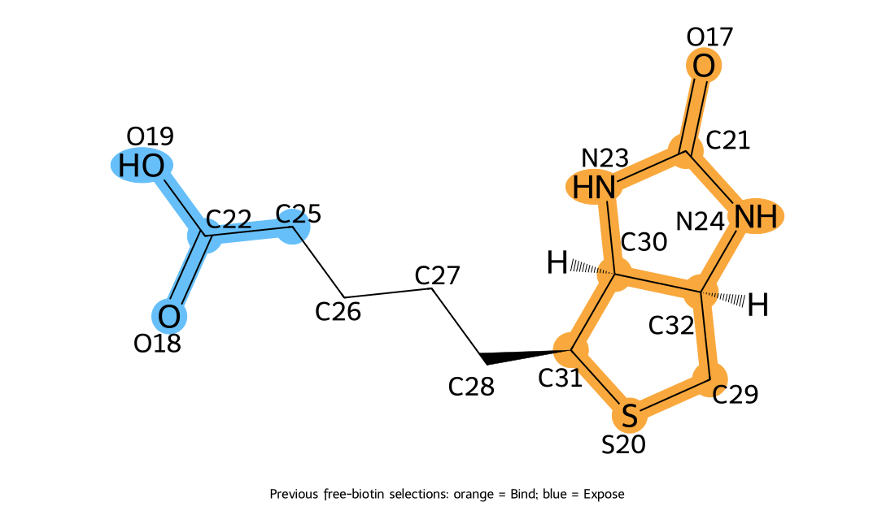

# Biotin NISE: chemistry review and proposed run

**Draft, 2026-09-17. No execution plan or job has been created. Attachment chemistry needs confirmation.**

The reference is the completed Protein Hunter/Boltz run
`test2/nise_runs/nise-C9CCE180-9E41-4BA3-95AE-CB03FBB867FA`.
Its ligand was free biotin. The saved atom-map signature exactly matches a fresh
map generated with the installed Boltz parser. This checks identities, not binding efficacy.

## Atom selections and attachment

| Selection | Previous Boltz atom names | Chemical region |
|---|---|---|
| Bind | C31, S20, C29, C32, N24, C30, N23, O17, C21 | Entire fused-ring head, including ureido carbonyl oxygen |
| Expose | C25 | Tail methylene adjacent to terminal carbonyl |
| Expose | C22, O18 | Terminal carboxyl carbon and carbonyl oxygen |
| Expose | O19 | Free-acid hydroxyl oxygen |
| None | C26, C27, C28 | Remaining tail methylenes |

This is a reasonable **orientation hypothesis**: bind the bicyclic head while
leaving the attachment end accessible. Each Bind atom must be within 6 Å of a
binder heavy atom; this does not impose hydrogen-bond geometry. Each Expose atom
must retain at least 50% of its isolated-ligand solvent-accessible area, measured
with a 1.4 Å water probe. All four requested exposed atoms have nonzero accessible
area in the generated isolated conformer (see audit.json); this is not a conformer
ensemble or a complex prediction.

Direct attachment to lysine converts the terminal acid to an amide; the acid
hydroxyl is replaced by the linkage nitrogen. Thus O19 is not present in that
conjugate, and **all labels must be regenerated after changing the molecule**.
[ChEBI's biocytin definition](https://www.ebi.ac.uk/chebi/CHEBI:27870) describes
this biotin-carboxyl/lysine-N6 condensation. A PEG or other reagent requires its
actual conjugated product, not the unreacted activated reagent, to specify the
linker chemistry correctly.

An [illustrative N-methylamide cap](amide_proxy_atoms.svg) and its regenerated
map are saved for discussion only. This cap is not a complete lysine, linker or
attached protein and has not been selected as the campaign ligand. Keeping an
exit region accessible to water does not establish clearance for the attached
protein; finalists need assessment with the actual attachment context.

## Proposed full campaign settings

Use the current source policy v3. Installed MCP guidance still describes older
defaults; a future governed plan must freeze the current implementation.

| Control | Proposed value |
|---|---|
| Initial generator | Protein Hunter X-token hallucination |
| Starts / binder lengths / initial masking | 1,000 / 65–150 aa / 50% X |
| Refinement | Two rounds, 3 LASErMPNN proposals per retained lineage per round; best passing sequence per lineage |
| Early gate | Combined Boltz score ≥0.80 after first refinement |
| Unrestrained gate | 3 proposals per lineage; Cα RMSD <2 Å and atom checks; all passing candidates advance |
| Seed expansion | 5 proposals per passing gate backbone; select 8 seeds from distinct original lineages |
| Optimisation | 8 trajectories; beam 3; cycle 1 has 64 proposals per trajectory; later cycles 32 per current parent |
| Duration | Maximum 30 optimisation cycles; stop after 4 cycles without sufficient improvement (>0.01) |
| Ranking | Ligand pLDDT/100 + Boltz P(bind) |
| Optimisation geometry | Cα RMSD <2.5 Å; ligand RMSD <2.5 Å from cycle 3; Bind/Expose checks throughout |
| Affinity | Geometry first; selective affinity batches of 8, upper-bound pruning enabled; omitted for initial backbones and unrestrained gate |
| Scheduler | Resident Boltz worker; recorded prediction seeds; empty MSA |
| Structure settings | 3 recycles, 200 diffusion steps, 1 sample; steering enabled |
| Affinity settings | 5 recycles, 200 steps, 3 samples per evaluated candidate |
| MPNN | Temperature 0.5; optimisation first-shell temperature 0.7 with 10 Å Cα shell; existing Ala/Gly/Cys settings unchanged |
| Random seed | 0 |
| NESSO / adaptive sampling / apo check | Off / off / off |

Phase-0 refinement and seed expansion apply atom requirements but do **not** apply
RMSD rejection. The dedicated unrestrained gate and optimisation stages apply
their respective RMSD checks. Eight trajectories are proposed from the current
defaults; the previous reference requested six and used a beam of one.

### Optional partial-noising branch: enabled for this proposal

Starting in optimisation cycle 2, take each trajectory's best current parent.
Identify residues with any heavy atom within 6 Å of any ligand heavy atom; mask
25% of those residues (nearest integer, at least one). Generate 32 masked Boltz
predictions, apply the normal checks and scoring, then choose one passing
backbone. Generate 32 complete LASErMPNN repairs, fold, check and score them.
Reserve one beam place for the best passing repair and two for ordinary MPNN
candidates. Ordinary proposals still come from all current parents.

A failed noising branch leaves its reserved place empty. Masked proteins are
intermediates, never final designs. The whole protein can move during refolding,
and MPNN can redesign beyond the masked residues. These radius/fraction choices
remain experimental, with software tests but no real-model acceptance run yet.

## Design scale

These are arithmetic ceilings assuming no attrition, full beams and no early stopping.

| Stage | Maximum structure predictions |
|---|---:|
| Initial starts | 1,000 |
| First refinement | 3,000 |
| Second refinement | 3,000 |
| Unrestrained gate | 3,000 |
| Seed expansion | 15,000 |
| Optimisation cycle 1, eight trajectories | 512 |
| Optimisation cycles 2–30 | 29 × 1,280 = 37,120 |
| **Total** | **62,632** |

A later full-beam trajectory evaluates 96 ordinary + 32 masked + 32 repair
structures = 160 per cycle. Noising adds at most 14,848 predictions to this
campaign. Affinity is a separate operation: its loose ceiling is 58,632 calls,
with three affinity samples per call; geometry rejection and selective scoring
reduce it. These are not counts of unique final sequences or timing benchmarks.
The run retains best-so-far designs across up to eight independent trajectories.

## Before launch

Confirm whether attachment is directly to lysine, through a named spacer/reagent,
or still undecided. Finalize the ligand graph, remap and review the selections,
then create a governed immutable plan. Repository instructions require a bounded
1–5-start end-to-end pilot before the 1,000-start campaign; it must reach cycle 2
to exercise masking and repair. Record that pilot separately with explicit reduced
budgets. Do not launch the full campaign until the pilot passes and these settings
and the attachment representation have been reviewed.

No runtime estimate is offered for the new branch. No GPU work, running-app update,
queue mutation or campaign launch was performed during this audit.
